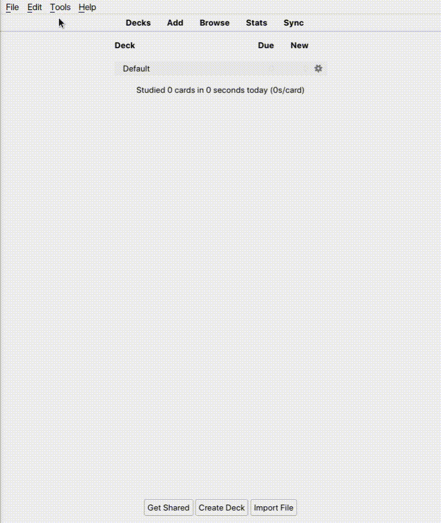
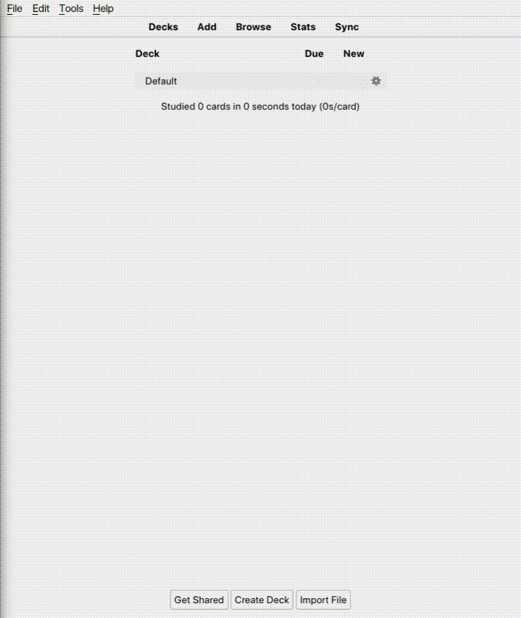

# Cloze Sequence

A minimal Anki template for the memorization of lists, enumerations and procedures. Very similar to the builtin cloze functionality, differing in that no new cards are created.

#### Installation

#### How it works

https://github.com/tekinosman/cloze-sequence/blob/main/cloze-sequence_howto.mov
